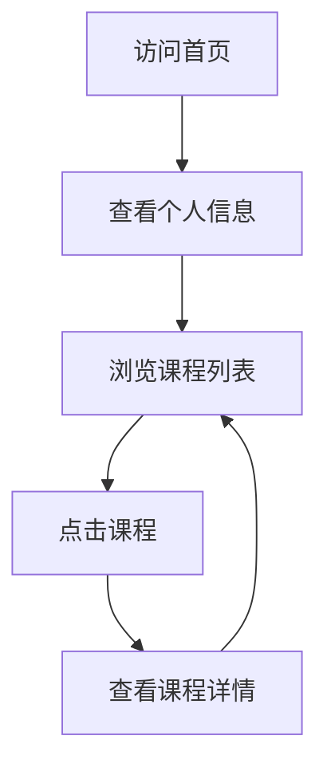

## 1. 产品概览
个人学生页面，用于展示袁佳琪的个人信息和课程列表
- 主要目的是提供一个简洁的个人展示平台，方便查看课程信息
- 目标用户为同学、老师和潜在雇主，展示专业能力和学习内容

## 2. 核心功能

### 2.1 用户角色
| 角色 | 注册方式 | 核心权限 |
|------|---------------------|------------------|
| 访问者 | 无需注册 | 浏览所有页面内容 |

### 2.2 功能模块
1. **首页**：个人信息展示、课程列表、导航栏
2. **课程详情页**：课程详细信息、学习内容（后续补充）

### 2.3 页面详情
| 页面名称 | 模块名称 | 功能描述 |
|-----------|-------------|---------------------|
| 首页 | 个人信息 | 展示姓名、学校、专业等基本信息 |
| 首页 | 课程列表 | 展示所有课程的卡片式列表，包含课程名称 |
| 首页 | 导航栏 | 提供页面导航功能 |
| 课程详情页 | 课程信息 | 展示课程详细介绍、学习内容等 |

## 3. 核心流程
用户访问首页 → 查看个人信息 → 浏览课程列表 → 点击课程进入详情页 → 查看课程详细内容

## 4. 用户界面设计
### 4.1 设计风格
- 主色调：蓝色 (#3B82F6) 和白色 (#FFFFFF)
- 辅助色：浅灰色 (#F3F4F6) 和深灰色 (#374151)
- 按钮风格：圆角矩形，有悬停效果
- 字体：无衬线字体，标题使用较大字号
- 布局风格：卡片式布局，响应式设计
- 图标风格：简约线性图标

### 4.2 页面设计概览
| 页面名称 | 模块名称 | UI元素 |
|-----------|-------------|-------------|
| 首页 | 个人信息 | 顶部横幅，包含姓名、学校、专业信息，使用较大字号和醒目的颜色 |
| 首页 | 课程列表 | 网格布局的课程卡片，每张卡片包含课程名称，鼠标悬停时有轻微的放大效果 |
| 首页 | 导航栏 | 顶部导航栏，包含网站标题和导航链接 |
| 课程详情页 | 课程信息 | 页面顶部显示课程名称，下方展示详细内容，使用清晰的排版 |

### 4.3 响应式设计
- 桌面优先设计，适配不同屏幕尺寸
- 在移动设备上，课程卡片布局从网格变为单列
- 导航栏在移动设备上变为汉堡菜单

### 4.4 3D场景指导
- 无3D场景需求