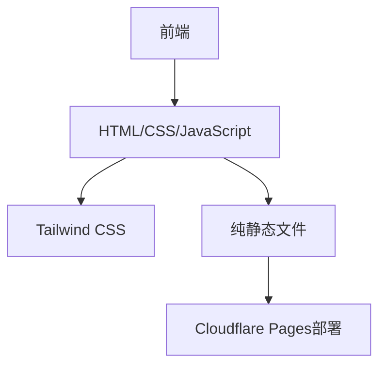

## 1. 架构设计


## 2. 技术描述
- 前端：纯HTML + CSS + JavaScript
- 样式框架：Tailwind CSS
- 构建工具：无（纯静态）
- 部署：Cloudflare Pages
- 无后端需求
- 无数据库需求

## 3. 路由定义
| 路由 | 用途 |
|-------|---------|
| / | 首页，展示个人信息和课程列表 |
| /courses/python-basics | Python基础课程详情页 |
| /courses/data-analysis | 数据分析技术课程详情页 |
| /courses/data-collection | 数据采集与处理课程详情页 |
| /courses/supply-chain | 供应链数据分析课程详情页 |
| /courses/database | 数据库原理与应用课程详情页 |

## 4. API定义
- 无API需求，纯静态页面

## 5. 服务器架构图
- 无服务器架构，纯静态部署

## 6. 数据模型
- 无数据模型，使用静态数据

## 7. 项目结构
```
/
├── index.html          # 首页
├── css/
│   └── style.css       # 样式文件
├── js/
│   └── script.js       # JavaScript文件
├── courses/            # 课程详情页目录
│   ├── python-basics.html
│   ├── data-analysis.html
│   ├── data-collection.html
│   ├── supply-chain.html
│   └── database.html
└── README.md           # 项目说明
```

## 8. 实现要点
- 使用Tailwind CSS实现响应式设计
- 纯静态页面，无需构建过程
- 课程详情页采用统一模板，后续可根据需要补充内容
- 部署到Cloudflare Pages，利用其全球CDN加速